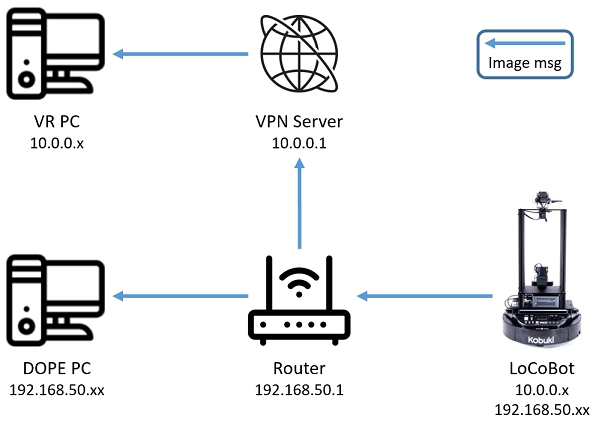

# dope

## clone repo
```
    $ git clone --recursive git@github.com:jinglinjackychen/dope.git
```

*You can run this code on a GPU computer and CPU computer, but if you want to execute DOPE program, please change GPU computer to run*

---
|Device         |GPU            |IP                         |
|:-------------:|:-------------:|:-------------------------:|
|LoCoBot        |No             |192.168.50.X and 10.0.0.X  |
|VR PC          |Yes            |10.0.0.X                   |
|DOPE PC        |Yes            |192.168.50.X               |


---

## Building docker image
```
    $ cd Docker && source build.sh
```

## How to run
```
    $ cd Docker && source docker_run.sh gpu
    Docker$ cd catkin_ws && catkin_make
    Docker$ source environment.sh ros_master_ip ros_ip
    Docker$ rosrun image_transport republish compressed in:=/camera/color/image_raw raw out:=/dope/image_raw
    Docker$ roslaunch dope dope.launch
```

## If you want to enter same container
```
    $ cd Docker && source docker_join.sh
    Docker$ source environment.sh ros_master_ip ros_ip
